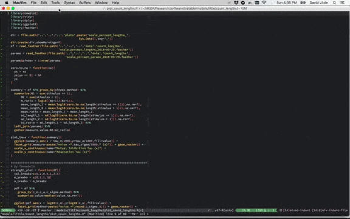

# vim-repl

A Vim 8 plugin for sane, frictionless interaction with multiple
[REPLs](https://en.wikipedia.org/wiki/Read%E2%80%93eval%E2%80%93print_loop) and
shells.



Each project you are working on uses a separate REPL for each file type
(langauge). A single command sends your code to the appropriate REPL based on
the buffer you're currently in.

This plugin uses [vim-projectroot](https://github.com/dbakker/vim-projectroot))
to determine the current project (so make sure you have it installed).

The available mappings are:

1. `<Plug>(repl-toggle)` - open/hide a REPL.
2. `<Plug>(repl-send-text)` - send the current line or selected region to the REPL
3. `<Plug>(repl-run)` - run the current file in the REPL
4. `<Plug>(repl-cd)` - change REPL directory to that of the current buffer's file
5. `<Plug>(repl-global-cd)` - like `<Plug>(repl-cd)` but use the global
   configuration (for an OS shell) instead of the local config (for a language
   specific REPL).
6. `<Plug>(repl-resize)` - resize REPL to be `g:repl_size` lines (default = 20)
7. `<Plug>(repl-switch)` - while in the REPL, switch to REPL 1-9 (see below)

The default mappings for these commands are as follows:

```vim
nmap <Leader>' <Plug>(repl-toggle)
tmap <C-w>' <Plug>(repl-toggle)
nmap <Leader>. <Plug>(repl-send-text)
vmap <Leader>. <Plug>(repl-send-text)

nmap <Leader>r <Plug>(repl-run)
nmap <Leader>cd <Plug>(repl-cd)
nmap <Leader>gcd <Plug>(repl-global-cd)
nmap <Leader>= <Plug>(repl-resize)

tmap <C-w>= <Plug>(repl-resize)
tmap <C-w>g <Plug>(repl-switch)

" not strictly related to plugin commands, but very handy for quickly reading
" errors that scroll past the size of the REPL screen.
tmap <C-w><C-u> <C-w>N<C-u>:set nonumber<cr> 
```

If you wish to remove the default mappings you can add `let
g:repl_default_mappings=0` to `.vimrc`.

All of the mappings first open a new REPL, if necessary. You can explicitly
open a new REPL using the `:REPL` command. You can pass an executable and its
arguments to a REPL if you want to open a specific program. For example:

```vim
:REPL ipython --quick
```

## Configuration

vim-repl comes preconfigured for the following languages:

1. Python (ipython)
2. Javascript (node)
3. MATLAB
4. R
5. Julia

You can easily configure it for your specific language or shell. For example,
to configure the commands for the python language vim-script includes the
following:

```vim
au FileType python let b:repl_program='ipython'
au FileType python let b:repl_cd_prefix='%cd '
au FileType python let b:repl_run_prefix='%run '
au FileType python let b:repl_send_text_delay='250m'
au FileType python let b:repl_send_prefix="%cpaste\n"
au FileType python let b:repl_send_suffix="\n--\n"
```

Pull requests for new language configurations are welcome.

These language specific variables default to global variables of the same name
(e.g. `g:repl_program='sh'`). 

You can configure the position and size of the REPL with the following
variables:

```vim
let g:repl_size = 20
let g:repl_position = 'botright'
```

## Mutliple REPLs

If you want to get fancy, you can have multiple REPLS per filetype and project.
Use the `<Plug>(repl-switch)` mapping to switch between different REPLS while
in one, and pass a count to `<Plug>(repl-toggle)` to switch to a specific REPL.
The `<Plug>(repl-switch)` mapping will open a prompt for a single number (1-9)
and switch to the given REPL.

In fact, each of the mappings can take a count which is used to specify which
REPL to use. When no count is specified, the last REPL used by the current
buffer is assumed. If this REPL was closed, it gets re-opened.

Likewise, the `:REPL` command takes an optional first argument ranging from 1-9
that indicates the REPL you wish to start and the default is determined
by the last REPL used in the current buffer.

## TODO:
1. create an operator
2. Make more of the defaults work correclty on Windows machines
3. Make the plugin compatible with both Vim 8 and Neovim
