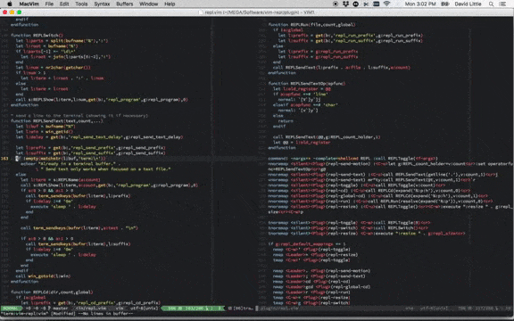

# vim-repl

A Vim 8 plugin for sane, frictionless interaction with multiple
[REPLs](https://en.wikipedia.org/wiki/Read%E2%80%93eval%E2%80%93print_loop) and
shells.

Each project you are working on uses a separate REPL for each file type
(langauge). A single command sends your code to the appropriate REPL based on
the buffer you're currently in.

This plugin uses [vim-projectroot](https://github.com/dbakker/vim-projectroot)
to determine the current project (so make sure you have it installed).

## Installation

vim-repl can be installed using any of the standard means of adding plugins to
vim. For example, using [vim-plug](https://github.com/junegunn/vim-plug) you
could add the following to `.vimrc`

```vim
Plug 'haberdashPI/vim-repl'
```

And then run `:source %` and `:PlugInstall` to install vim-repl.

## Available mappings and commands
The available mappings and commands are as follows:

### Open/hide a REPL
```vim
<Plug>(repl-toggle)
```


In a file buffer, open and move to the REPL associated with that buffer.
In a REPL, hide the REPL (it continues to run in the background).

### Send current line or selected region
```vim
<Plug>(repl-send-text)
```


Send the current line or highlighted text to the REPL associated with this 
buffer.

### Send motion
```vim
<Plug>(repl-send-motion)
```


Send the text specified by a motion to the REPL associated with this buffer.

### Run current file
```vim
<Plug>(repl-run)
```
Runs the current file in the REPL associated with this buffer.
Depends on language specific configuration (see below).

### Change directory
```vim
<Plug>(repl-cd)
```

Change directory to that of the current buffer's file in the REPL associated
with this buffer. Depends on language specific configuration (see below).

```vim
<Plug>(repl-global-cd)
```

Like `<Plug>(repl-cd)` but use the global configuration (for an OS shell)
instead of the local config (for a language specific REPL).

### Resize 
```vim
<Plug>(repl-resize)
```
Resize REPL to be `g:repl_size` lines (default = 20). If passed a count
resize to 'count' number of lines.

### Switch REPLs
```vim
<Plug>(repl-switch)
```
While in the REPL, switch to REPL 1-9 (see below).

### REPL

This command opens a given program with the given passed arguments.  This is
called automatically. It is only necessary to call manually if you wish to
override the default REPL program.

For example to remove all colors in ipython you could call

```vim
:REPL ipython --colors=no
```

### REPLCloseAll

This command close all REPLs that have been opened.

## Default Mappings
The default key mappings are as follows:

```vim
nmap <C-w>' <Plug>(repl-toggle)
tmap <C-w>' <Plug>(repl-toggle)
nmap <Leader>; <Plug>(repl-send-text)
vmap <Leader>. <Plug>(repl-send-text)
nmap <Leader>. <Plug>(repl-send-motion)

nmap <Leader>r <Plug>(repl-run)
nmap <Leader>cd <Plug>(repl-cd)
nmap <Leader>gcd <Plug>(repl-global-cd)
nmap <Leader>= <Plug>(repl-resize)

tmap <C-w>= <Plug>(repl-resize)
tmap <C-w>g <Plug>(repl-switch)

" not strictly related to plugin commands, but very handy for quickly reading
" errors that scroll past the size of the REPL screen.
tmap <C-w><C-u> <C-w>N<C-u>:set nonumber<cr> 
```

If you wish to remove the default mappings you can add `let
g:repl_default_mappings=0` to `.vimrc`.

## Configuration

vim-repl comes preconfigured for the following languages:

1. Python (ipython)
2. Javascript (node)
3. MATLAB
4. R
5. Julia

You can easily configure it for your specific language or shell. For example,
if python were not already available you could add the following to `.vimrc`:

```vim
augroup PythonREPL
  au!
  au FileType python let b:repl_program='ipython'
  au FileType python let b:repl_cd_prefix='%cd '
  au FileType python let b:repl_run_prefix='%run '
  au FileType python let b:repl_send_text_delay='250m'
  au FileType python let b:repl_send_prefix="%cpaste\n"
  au FileType python let b:repl_send_suffix="\n--\n"
augroup END
```

Pull requests for new language configurations are welcome.

These language specific variables default to global variables of the same name
(e.g. `g:repl_program='sh'`). 

You can configure the position and size of the REPL with the following
variables:
```vim
let g:repl_size = 20
let g:repl_position = 'botright'
```

## Multiple REPLs
You can have multiple REPLS for a given filetype and project. These are
referred to using numbers 1-9. Pass a count to `<Plug>(repl-toggle)` to switch
to a specific REPL. The `<Plug>(repl-switch)` mapping will open a prompt for a
single number (1-9) and switch to the given REPL. 



In fact, each of the mappings can take a count which is used to specify which
REPL to use. When no count is specified, the last REPL used by the current
buffer is assumed, and REPL 1 is assumed if no REPL was previosuly used. If this
REPL was closed, it gets re-opened.

Likewise, the `:REPL` command takes an optional first argument ranging from 1-9
that indicates the REPL you wish to start and the default is determined
by the last REPL used in the current buffer.

## TODO:
1. Make sure all of the defaults work correclty on Windows machines
2. Make the plugin compatible with both Vim 8 and Neovim

